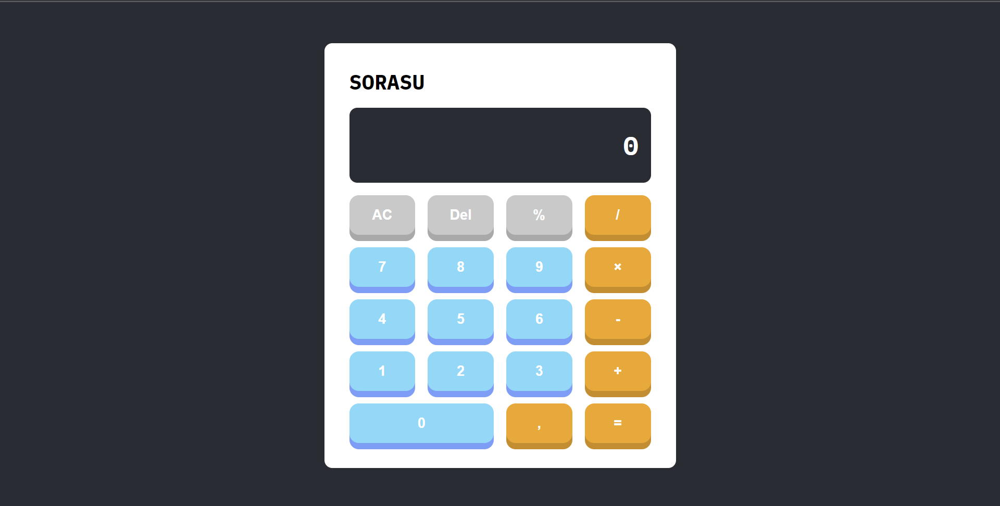
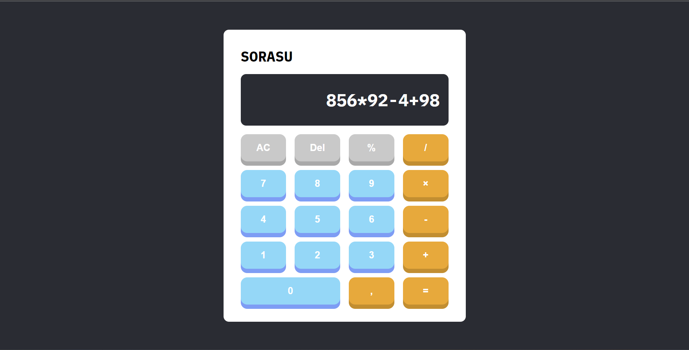
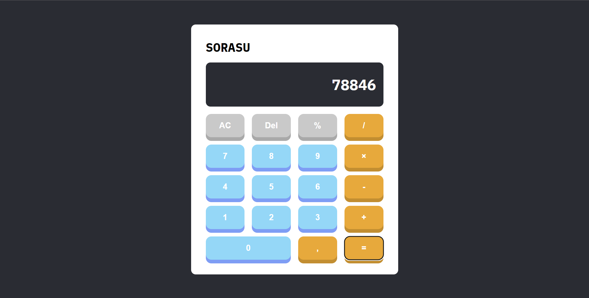

# Simple Calculator

This is a personal challenge for me to start learning ReactJS. The purpose of this chanllenge is help me get used to working with ReactJS so it's kind of simple.
## Overview

### The challenge

Users should be able to use this calculate for some simple math.

### Screenshot

- An example 

- And the result             

### Built with

- ReactJS
- Semantic HTML5 markup
- CSS custom properties
- Transition and transform properties (To make it more cooler! I guess?)
- Flexbox
- Simple fetching data from API function

## Author

- Website - [BeingX234 or Hieu Nguyen](https://github.com/BeingX234)

